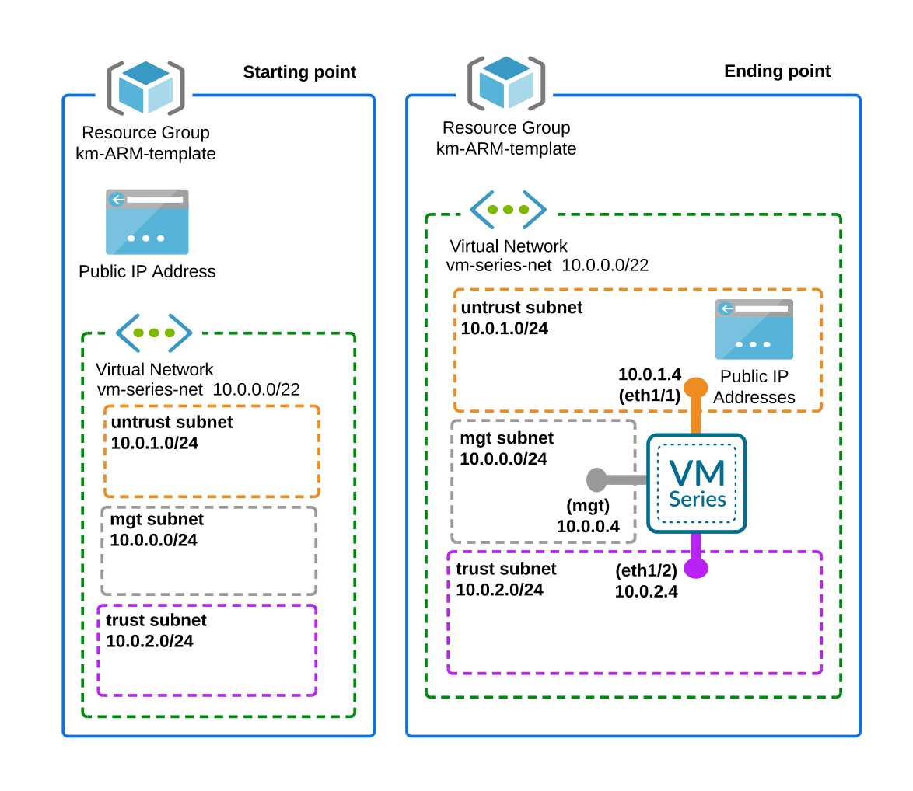

# VM-Series Firewall Deployment — Single Instance

`Add-Single-VM-series-template.json`

This ARM template deploys a single Palo Alto Networks VM-Series next-generation firewall with three network interfaces (management, untrust, trust) into an existing Azure resource group.

> This template is released under an as-is, best effort, and is community supported.

## Architecture



## Resources Deployed

| Resource | Type | Conditional |
|----------|------|-------------|
| Partner Center Tracking | `Microsoft.Resources/deployments` | No |
| Public IP (untrust) | `Microsoft.Network/publicIPAddresses` | Yes — only when `publicIPNewOrExisting` = `new` |
| Management NSG | `Microsoft.Network/networkSecurityGroups` | No |
| Virtual Network | `Microsoft.Network/virtualNetworks` | Yes — skipped when `vnetNewOrExisting` = `existing` |
| NIC — eth0 (management) | `Microsoft.Network/networkInterfaces` | No |
| NIC — eth1 (untrust) | `Microsoft.Network/networkInterfaces` | No |
| NIC — eth2 (trust) | `Microsoft.Network/networkInterfaces` | No |
| Availability Set | `Microsoft.Compute/availabilitySets` | Yes — skipped when `availabilitySetName` = `None` |
| VM-Series VM | `Microsoft.Compute/virtualMachines` | No |

## Network Interfaces

| Interface | Subnet | IP Allocation | IP Forwarding | Accelerated Networking | Public IP | NSG |
|-----------|--------|---------------|---------------|------------------------|-----------|-----|
| eth0 (management) | mgmt (10.0.0.0/24) | Dynamic | No | No | No | Yes — DefaultNSG |
| eth1 (untrust) | untrust (10.0.1.0/24) | Static (10.0.1.4) | Yes | Yes | Optional | No |
| eth2 (trust) | trust (10.0.2.0/24) | Static (10.0.2.4) | Yes | Yes | No | No |

## Default Settings

| Parameter | Default | Description |
|-----------|---------|-------------|
| `vmName` | `VM-Series` | VM name in the Azure portal |
| `imageVersion` | `latest` | PAN-OS image version |
| `vmSize` | `Standard_D3_v2` | Azure VM size |
| `virtualNetworkName` | `vmseries-vnet` | Virtual network name |
| `vnetNewOrExisting` | `new` | Create new or use existing VNET |
| `virtualNetworkAddressPrefixes` | `10.0.0.0/22` | VNET address space |
| `subnet0Name` / `subnet1Name` / `subnet2Name` | `mgmt` / `untrust` / `trust` | Subnet names |
| `subnet0Prefix` / `subnet1Prefix` / `subnet2Prefix` | `10.0.0.0/24` / `10.0.1.0/24` / `10.0.2.0/24` | Subnet CIDRs |
| `subnet1StartAddress` | `10.0.1.4` | Static IP assigned to eth1 (untrust) |
| `subnet2StartAddress` | `10.0.2.4` | Static IP assigned to eth2 (trust) |
| `authenticationType` | `password` | `password` or `sshPublicKey` |
| `publicIPNewOrExisting` | `new` | `new`, `existing`, or `none` |
| `publicIPAddressName` | `vmseries-pip` | Public IP resource name |
| `publicIPAllocationMethod` | `Static` | `Static` or `Dynamic` |
| `srcIPInboundNSG` | `0.0.0.0/0` | Source CIDR for management NSG inbound rule |
| `bootstrap` | `no` | Pass bootstrap data via `customData` |
| `zone` | `None` | Availability Zone (`1`, `2`, `3`, or `None`) |
| `availabilitySetName` | `None` | Name of availability set (`None` to skip) |
| `resourceTags` | `{}` | Tags applied to all created resources |

## Required Parameters (No Default)

| Parameter | Type | Description |
|-----------|------|-------------|
| `adminUsername` | string | Admin username for the VM-Series (do not use `admin` or `root`) |
| `adminPasswordOrKey` | securestring | Admin password or SSH public key |

## Deployment

### Azure CLI

```bash
# Validate
az deployment group validate \
  --resource-group <RESOURCE_GROUP> \
  --template-file "Add-Single-VM-series-template.json" \
  --parameters adminUsername="paloalto" adminPasswordOrKey="<PASSWORD>"

# Deploy
az deployment group create \
  --resource-group <RESOURCE_GROUP> \
  --template-file "Add-Single-VM-series-template.json" \
  --parameters adminUsername="paloalto" adminPasswordOrKey="<PASSWORD>"
```

### With a Parameters File

```bash
az deployment group create \
  --resource-group <RESOURCE_GROUP> \
  --template-file "Add-Single-VM-series-template.json" \
  --parameters @params.json
```

Example `params.json`:

```json
{
    "$schema": "https://schema.management.azure.com/schemas/2019-04-01/deploymentParameters.json#",
    "contentVersion": "1.0.0.0",
    "parameters": {
        "adminUsername": { "value": "paloalto" },
        "adminPasswordOrKey": { "value": "YourSecurePassword1!" },
        "vmName": { "value": "fw-prod-01" },
        "imageVersion": { "value": "11.2.8" },
        "srcIPInboundNSG": { "value": "203.0.113.0/24" },
        "vnetNewOrExisting": { "value": "existing" },
        "virtualNetworkName": { "value": "prod-vnet" },
        "virtualNetworkExistingRGName": { "value": "networking-rg" },
        "subnet0Name": { "value": "mgmt-subnet" },
        "subnet1Name": { "value": "untrust-subnet" },
        "subnet2Name": { "value": "trust-subnet" },
        "subnet1StartAddress": { "value": "10.1.1.4" },
        "subnet2StartAddress": { "value": "10.1.2.4" },
        "zone": { "value": "1" },
        "resourceTags": {
            "value": {
                "Environment": "Production",
                "Owner": "NetSecOps"
            }
        }
    }
}
```

## Supported VM Sizes

`Standard_D3_v2`, `Standard_D4_v2`, `Standard_D5_v2`, `Standard_D4_v3`, `Standard_DS3_v2`, `Standard_DS4_v2`, `Standard_DS5_v2`, `Standard_D8_v3`, `Standard_D16_v3`, `Standard_D8s_v3`, `Standard_D16s_v3`, `Standard_F8s_v2`, `Standard_F32s_v2`, `Standard_D8_v4`, `Standard_D16_v4`, `Standard_D8s_v4`, `Standard_D16s_v4`

## Supported PAN-OS Versions

`latest`, `10.2.1014`, `11.1.407`, `11.1.612`, `11.2.5`, `11.2.8`

## Notes

- **Marketplace agreement**: The VM-Series image requires accepting the Azure Marketplace terms before first deployment:
  ```bash
  az vm image terms accept --publisher paloaltonetworks --offer vmseries-flex --plan byol
  ```
- **Existing VNET**: When using `vnetNewOrExisting` = `existing`, the VNET and all three subnets (management, untrust, trust) must already exist. Set `virtualNetworkExistingRGName` to the VNET's resource group if it differs from the deployment resource group.
- **NSG**: The management NSG (`DefaultNSG`) is attached directly to the eth0 NIC, so it protects management access regardless of whether the VNET is new or existing. The NSG allows all protocols from `srcIPInboundNSG` and intra-VNET traffic, then denies everything else. Restrict `srcIPInboundNSG` to your management IP/CIDR in production.
- **Static IPs on dataplane interfaces**: eth1 (untrust) and eth2 (trust) use static private IP addresses set by `subnet1StartAddress` and `subnet2StartAddress`. These addresses must fall within their respective subnet ranges. Azure reserves the first four addresses (.0–.3) in each subnet, so .4 is the first usable address.
- **Public IP**: When `publicIPNewOrExisting` = `new`, a Standard SKU public IP is created and assigned to eth1 (untrust). Set to `none` to deploy without any public IP on the untrust interface. Standard SKU public IPs require `Static` allocation.
- **Availability**: Set `zone` to `1`, `2`, or `3` for Availability Zone placement, **or** set `availabilitySetName` for Availability Set placement. Do not set both — Azure does not allow a VM in both a zone and an availability set. Leave both at their defaults (`None`) to deploy without availability configuration.
- **Bootstrap**: Set `bootstrap` = `yes` and provide the bootstrap configuration string in `customData`. The value is base64-encoded and passed to the VM. When `bootstrap` = `no` (default), no custom data is sent.
- **Authentication**: Set `authenticationType` = `sshPublicKey` and provide the public key in `adminPasswordOrKey` to use SSH key authentication instead of a password.
- **Boot diagnostics**: Enabled by default using managed storage.
- **Resource tags**: Use the `resourceTags` parameter to apply tags to all deployed resources (NSG, VNET, NICs, public IP, availability set, and VM).
